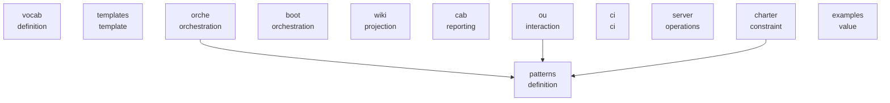

# Architecture

quicue.ca models any domain as typed dependency graphs in CUE. Modules compose via CUE unification — each layer constrains the next.

## Module Layers

## Layers

### definition

- **[vocab](modules/vocab.md)** — Core schemas: #Resource, #Action, #TypeRegistry, #ActionDef
- **[patterns](modules/patterns.md)** — Algorithms: graph, bind, deploy, health, SPOF, viz, TOON, OpenAPI, validation

### template

- **[templates](modules/templates.md)** — 29 platform-specific providers, each a self-contained CUE module

### orchestration

- **[orche](modules/orche.md)** — Orchestration schemas: execution steps, federation, drift detection, Docker site bootstrap
- **[boot](modules/boot.md)** — Bootstrap schemas: #BootstrapResource, #BootstrapPlan, credential collectors

### constraint

- **[charter](modules/charter.md)** — Constraint-first project planning: declare scope, evaluate gaps, track gates. SHACL gap report projection.

### projection

- **[wiki](modules/wiki.md)** — #WikiProjection — MkDocs site generation from resource graphs

### reporting

- **[cab](modules/cab.md)** — Change Advisory Board reports: impact, blast radius, runbooks

### interaction

- **[ou](modules/ou.md)** — Role-scoped views: #InteractionCtx narrows #ExecutionPlan by role, type, name, layer. Hydra W3C JSON-LD export.

### ci

- **[ci](modules/ci.md)** — Reusable GitLab CI templates for CUE validation, export, topology, impact

### operations

- **[server](modules/server.md)** — FastAPI execution gateway for running infrastructure commands

### value

- **[examples](modules/examples.md)** — 17 working examples from minimal 3-layer to full 30-resource datacenter

## Key Invariants

1. **No runtime template resolution.** Every `{param}` placeholder is resolved at `cue vet` time.
2. **The graph is the source of truth.** All artifacts are derived projections.
3. **Struct-as-set everywhere.** `@type`, `depends_on`, and tags use `{key: true}` for O(1) membership.
4. **Hidden fields for export control.** Intermediate computation uses `_prefix` to prevent JSON bloat.
5. **Topology-sensitive transitive closure.** Fan-in is the bottleneck, not node count.

---
*Generated from quicue.ca registries by `#DocsProjection`*