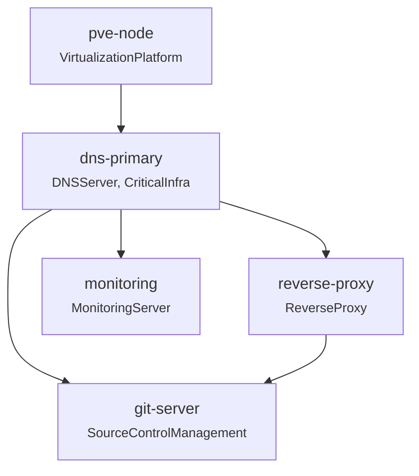

# graph-patterns

Comprehensive graph queries and analysis patterns for infrastructure dependency graphs.

## Overview

This example demonstrates all graph patterns available in `quicue.ca/patterns@v0`:

| Pattern | Purpose | Input |
|---------|---------|-------|
| `#InfraGraph` | Build traversable graph from resources | `{Input: resources}` |
| `#ImpactQuery` | What breaks if X fails? | `{Graph: g, Target: "name"}` |
| `#DependencyChain` | Full path from resource to root | `{Graph: g, Target: "name"}` |
| `#CriticalityRank` | Rank by dependent count | `{Graph: g}` |
| `#ImmediateDependents` | Direct dependents only (not transitive) | `{Graph: g, Target: "name"}` |
| `#GroupByType` | Group resources by @type | `{Graph: g}` |
| `#GraphMetrics` | Summary statistics | `{Graph: g}` |
| `#ExportGraph` | Clean export for external tools | `{Graph: g}` |
| `#ValidateGraph` | Check for structural issues | `{Input: resources}` |
| `#CycleDetector` | Validate DAG property (pre-construction) | `{Input: rawResources}` |
| `#ConnectedComponents` | Find orphaned/isolated subgraphs | `{Graph: g}` |
| `#Subgraph` | Extract induced subgraph by roots/target/radius | `{Graph: g, Roots/Target: ...}` |
| `#GraphDiff` | Structural delta between two graph versions | `{Before: g1, After: g2}` |
| `#CriticalPath` | CPM: earliest/latest times, slack, critical chain | `{Graph: g, Weights?: {...}}` |
| `#ComplianceCheck` | Evaluate declarative structural rules | `{Graph: g, Rules: [...]}` |

## Key Concepts

- `depends_on` uses struct-as-set: `{[string]: true}`
- `#InfraGraph` computes `_depth`, `_ancestors`, `_path` per resource
- Queries are CUE expressions over the computed graph
- All patterns use CUE unification: `#Pattern & {Input: data}`

## The Graph

```
pve-node (depth 0)
    └── dns-primary (depth 1)
            ├── reverse-proxy (depth 2)
            │       └── git-server (depth 3)
            ├── git-server (depth 3)
            └── monitoring (depth 2)
```

## Pattern Reference

### #InfraGraph - Build the Graph

The foundation pattern. Converts string-based `depends_on` to a traversable graph with computed properties.

```cue
import "quicue.ca/patterns@v0"

_resources: {
    "pve-node": {
        name: "pve-node"
        "@type": {VirtualizationPlatform: true}
    }
    "dns-primary": {
        name: "dns-primary"
        "@type": {DNSServer: true, CriticalInfra: true}
        depends_on: {"pve-node": true}
    }
}

infra: patterns.#InfraGraph & {Input: _resources}

// Now available:
// infra.resources["dns-primary"]._depth     = 1
// infra.resources["dns-primary"]._ancestors = {pve-node: true}
// infra.resources["dns-primary"]._path      = ["dns-primary", "pve-node"]
// infra.topology.layer_0                    = {pve-node: true}
// infra.topology.layer_1                    = {dns-primary: true}
// infra.roots                               = ["pve-node"]
// infra.leaves                              = ["dns-primary"]
// infra.valid                               = true (no missing deps)
```

**Computed fields per resource:**
- `_depth`: Distance from root (0 = no dependencies)
- `_ancestors`: Transitive closure of all dependencies
- `_path`: Route to root via first parent

**Graph-level outputs:**
- `topology`: Resources grouped by depth layer
- `roots`: Resources with no dependencies
- `leaves`: Resources nothing depends on
- `valid`: True if all dependency references exist

---

### #ImpactQuery - What Breaks If X Fails?

Find all resources transitively affected if target goes down.

```cue
impact: patterns.#ImpactQuery & {
    Graph:  infra
    Target: "dns-primary"
}

// impact.affected       = ["reverse-proxy", "git-server", "monitoring"]
// impact.affected_count = 3
```

**Use cases:**
- Pre-maintenance planning: "If I take down dns-primary, what's affected?"
- Incident response: "DNS is down, what services are impacted?"
- Dependency auditing: "How critical is this resource?"

---

### #DependencyChain - Path to Root

Get the full dependency path from a resource back to a root node.

```cue
chain: patterns.#DependencyChain & {
    Graph:  infra
    Target: "git-server"
}

// chain.path      = ["git-server", "dns-primary", "pve-node"]
// chain.depth     = 3
// chain.ancestors = ["dns-primary", "reverse-proxy", "pve-node"]
```

**Note:** `path` follows the first parent only (for multi-parent DAGs). Use `ancestors` for the complete set.

**Use cases:**
- Debugging: "What does git-server depend on to work?"
- Documentation: Generate dependency diagrams
- Startup ordering: Boot in reverse path order

---

### #CriticalityRank - Most Critical Resources

Rank resources by how many other resources depend on them (transitively).

```cue
crit: patterns.#CriticalityRank & {Graph: infra}

// crit.ranked = [
//   {name: "pve-node",      dependents: 4},
//   {name: "dns-primary",   dependents: 3},
//   {name: "reverse-proxy", dependents: 1},
//   {name: "git-server",    dependents: 0},
//   {name: "monitoring",    dependents: 0}
// ]
```

**Use cases:**
- Prioritize monitoring/alerting for high-criticality resources
- Focus hardening efforts on most-depended-on infrastructure
- Identify single points of failure

---

### #ImmediateDependents - Direct Dependents Only

Find resources that *directly* depend on target (not transitively).

```cue
deps: patterns.#ImmediateDependents & {
    Graph:  infra
    Target: "dns-primary"
}

// deps.dependents = ["reverse-proxy", "git-server", "monitoring"]
// deps.count      = 3
```

**Difference from #ImpactQuery:**
- `#ImmediateDependents`: Only resources with `depends_on: {"dns-primary": true}`
- `#ImpactQuery`: All resources where `dns-primary` appears in `_ancestors`

**Use cases:**
- Update notifications: "These services directly use dns-primary"
- Configuration changes: "Direct consumers need config updates"

---

### #GroupByType - Resources by Type

Group resources by their `@type` values.

```cue
byType: patterns.#GroupByType & {Graph: infra}

// byType.groups = {
//   VirtualizationPlatform:    ["pve-node"]
//   DNSServer:                 ["dns-primary"]
//   CriticalInfra:             ["dns-primary"]
//   ReverseProxy:              ["reverse-proxy"]
//   SourceControlManagement:   ["git-server"]
//   MonitoringServer:          ["monitoring"]
// }
// byType.counts = {
//   VirtualizationPlatform:    1
//   DNSServer:                 1
//   ...
// }
```

**Note:** Resources with multiple types appear in multiple groups.

**Use cases:**
- Service catalog: "Show all DNS servers"
- Type-specific operations: "Backup all databases"
- Inventory reports: "How many containers vs VMs?"

---

### #GraphMetrics - Summary Statistics

Get aggregate metrics about the graph structure.

```cue
metrics: patterns.#GraphMetrics & {Graph: infra}

// metrics.total_resources = 5
// metrics.root_count      = 1
// metrics.leaf_count      = 2
// metrics.max_depth       = 3
// metrics.total_edges     = 5
```

**Use cases:**
- Dashboard widgets: "Infrastructure at a glance"
- Complexity tracking: "Graph depth over time"
- Validation: "Expected N resources, got M"

---

### #ExportGraph - Clean Export

Export graph with computed properties for external tools (JSON, databases, etc.).

```cue
export: patterns.#ExportGraph & {Graph: infra}

// export.resources = [
//   {name: "pve-node", "@type": {VirtualizationPlatform: true}, depth: 0, ancestors: []},
//   {name: "dns-primary", "@type": {DNSServer: true, CriticalInfra: true},
//    depends_on: {"pve-node": true}, depth: 1, ancestors: ["pve-node"]},
//   ...
// ]
// export.summary = {total: 5, roots: ["pve-node"], leaves: [...], max_depth: 3}
```

**Use cases:**
- Export to Neo4j, GraphQL, or other graph databases
- Generate JSON for visualization tools
- Create reports with computed depth/ancestors included

---

### #ValidateGraph - Check for Issues

Validate graph structure before processing. Catches common errors.

```cue
validate: patterns.#ValidateGraph & {Input: _resources}

// If valid:
// validate.valid = true
// validate.issues = {missing_dependencies: [], self_references: [], empty_types: []}

// If invalid (e.g., depends_on: {"nonexistent": true}):
// validate.valid = false
// validate.issues.missing_dependencies = [{resource: "web", missing: "nonexistent"}]
```

**Checks performed:**
1. **Missing dependencies**: `depends_on` references a resource that doesn't exist
2. **Self-references**: Resource depends on itself
3. **Empty types**: `@type: {}` with no type information

**Use cases:**
- CI validation: Fail pipeline if graph is invalid
- Import validation: Check external data before processing
- Pre-flight checks: Validate before expensive operations

---

## Run

```bash
# Full output
cue eval ./examples/graph-patterns/ -e output

# Just topology
cue eval ./examples/graph-patterns/ -e output.topology

# Just impact analysis
cue eval ./examples/graph-patterns/ -e output.impact_if_dns_fails

# Mermaid diagram
cue export ./examples/graph-patterns/ -e mermaid --out text
```

## Output

```cue
topology: {
    layer_0: {
        "pve-node": true
    }
    layer_1: {
        "dns-primary": true
    }
    layer_2: {
        "reverse-proxy": true
        monitoring:      true
    }
    layer_3: {
        "git-server": true
    }
}
roots: ["pve-node"]
leaves: ["git-server", "monitoring"]
impact_if_dns_fails: {
    affected: ["reverse-proxy", "git-server", "monitoring"]
    count: 3
}
criticality_ranking: [{
    name:       "pve-node"
    dependents: 4
}, {
    name:       "dns-primary"
    dependents: 3
}, {
    name:       "reverse-proxy"
    dependents: 1
}, {
    name:       "git-server"
    dependents: 0
}, {
    name:       "monitoring"
    dependents: 0
}]
resources_by_type: {
    VirtualizationPlatform: ["pve-node"]
    DNSServer: ["dns-primary"]
    CriticalInfra: ["dns-primary"]
    ReverseProxy: ["reverse-proxy"]
    SourceControlManagement: ["git-server"]
    MonitoringServer: ["monitoring"]
}
summary: {
    total_resources: 5
    max_depth:       3
    total_edges:     5
}
```

## Mermaid Diagram



## Validation Example

```cue
// Bad graph with multiple issues
_bad: {
    "orphan": {
        name: "orphan"
        "@type": {DNSServer: true}
        depends_on: {"nonexistent": true}  // Missing!
    }
    "circular": {
        name: "circular"
        "@type": {ReverseProxy: true}
        depends_on: {"circular": true}  // Self-reference!
    }
    "untyped": {
        name: "untyped"
        "@type": {}  // Empty types!
    }
}

validate: patterns.#ValidateGraph & {Input: _bad}

// validate.valid = false
// validate.issues = {
//   missing_dependencies: [{resource: "orphan", missing: "nonexistent"}]
//   self_references:      [{resource: "circular"}]
//   empty_types:          [{resource: "untyped"}]
// }
```

Use `#ValidateGraph` in CI pipelines to catch issues before deployment.
